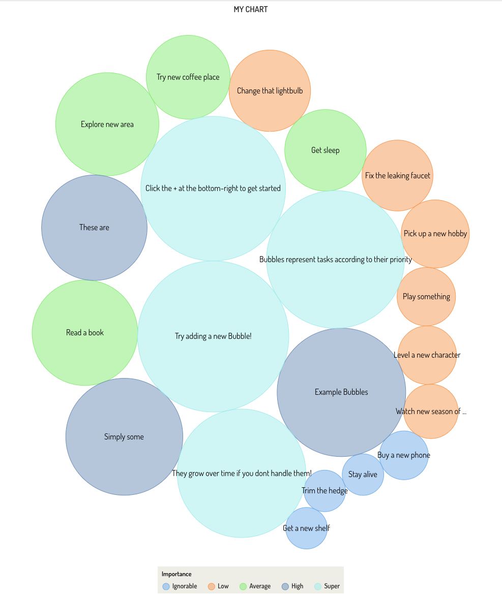

# Bubblr

---

Try it out at [bubblr.netlify.app](https://bubblr.netlify.app)!

Bubblr is a task management tool.
Bubblr lets you create and tasks in the form of bubbles.
Bubbles grow over time if you leave them alone!
Their growth rate and sizes are limited by the importance of the task.

## Features

- User login authentication
- Dark/Light theme toggler

## Techstack

- Framework
  >React Native (with [Expo](https://expo.dev/) )

- Database (Serverless RDS):
  >[Supabase](https://supabase.com/)

- UI
  >[React Native Elements](https://reactnativeelements.com/)

- Plot
  >[Highcharts](https://www.highcharts.com/)

## Thoughts & Challenges

Every single element of the tech-stack, although supposed to speed-up development, had a steep learning-curve to them.

React-Native requires additional configuration to run on web which took time figuring out.

Whilst developing, tons of bugs and errors started creeping up and squishing them took a lot of time.

As a result of developing web-first, the app currently *does not work* on mobile, even though the due-ly intended platform was mobile.

Supabase was also a learning curve on its own.

Thinking in React + TypeScript was probably one of my biggest time-sinks too. It took a lot of time wrapping my head around working with some of the programming patterns but I eventually got there. Namely, the provider pattern, and (safely calling) the useEffect hooks.

useEffect runaway errors ate away so much time. This was made complicated due to an interaction with a provider.

Parts of the UI libraries don't work either due to being deprecated/outdated, or not in proper support for React-Native. Debugging + finding alternatives took time as well.

## Further work

This App is still under development
